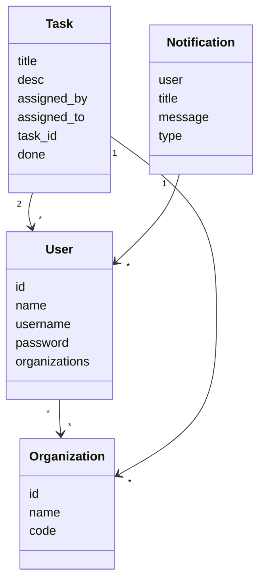
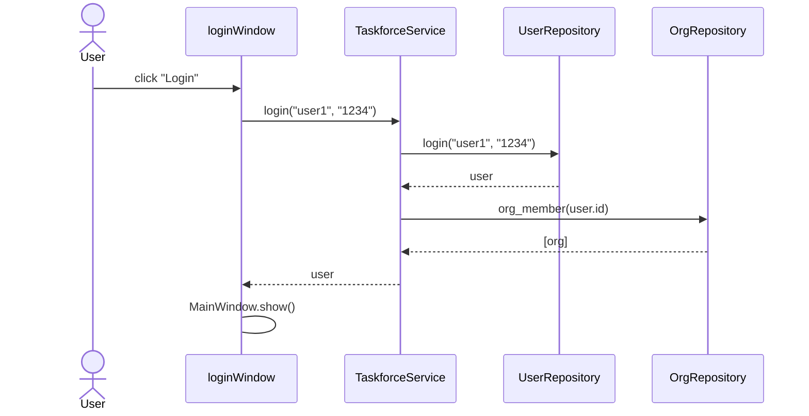
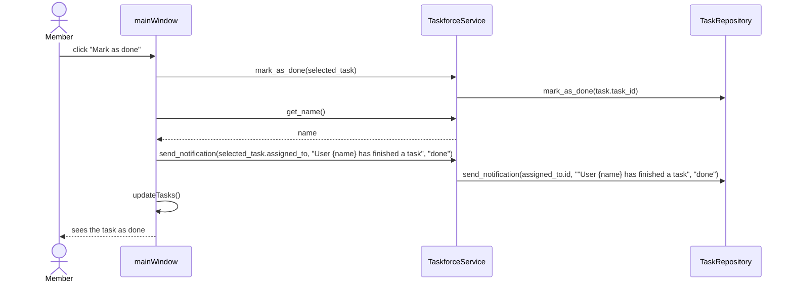

# Arkkitehtuurikuvaus

## Käyttöliittymä

Ohjelmassa on kaksi pääikkunaa:
- Kirjautumisikkuna
- Tehtäväikkuna

Näistä näkyy vain yksi kerrallaan. Lisäksi on seuraavia ikkunoita, jotka voivat näkyä pääikkunoiden päällä:

- Tilinluonti
- Organisaation liittyminen
- Uuden organisaation luonti
- Uuden tehtävän luonti

Nämä ikkunat voivat ilmestyä eri vaiheissa käyttöä.

Käyttöjärjestelmän toiminta on pyritty eristämään mahdollisimman hyvin sovelluksen logiikasta vastaavasta koodista. Kaikki sovelluslogiikan toiminnat kutsutaan erilaisilla Serivce-luokkien metodeilla, jotka taas vastaavat sovelluslogiikasta.

Käyttöjärjestelmä muodostetaan pääosin kun käyttäjä kirjautuu sisään, tosin joitakin asioita voidaan päivittää kun Service-luokkien metodeja kutsutaan. Esimerkiksi jos käyttäjä merkitsee tehtävän valmiiksi, niin kutsutaan käyttöliittymän updateTasks(), joka rakentaa uudelleen tehtävälistan kutsumalla TaskService-luokan metodia get_tasks().

Kuvitellaan tilanne, jossa organisaation ylläpitäjä kirjautuu tililleen, jolla hän on jakanut tehtäviä sekä kommentoinut kyseisiä tehtäviä. Tällöin kirjautuessa käyttöliittymä piirtää kaikille annetuille tehtäville napit, piirtää näytölle tiedot sillä hetkellä valitusta tehtävästä, piirtää kommentit senhetkiselle tehtävälle. Lisäksi käyttöliittymä lisää yläpalkin valikkoihin napit organisaation valintaa varten sekä käyttäjien ylentämistä varten.

Ohjelmassa käytetään luokkia ´User´ ja ´Organizations´ kuvaamaan käyttäjiä ja organisaatioita, joihin käyttäjät voivat liittyä. Lisäksi on olemassa luokat Task ja Notification, jotka kuvaavat tehtäviä joita käyttäjät voivat saada sekä ilmoituksia, joita käyttäjälle voi tulla.

# Sekvenssikaavio
Alla kuvataan kaksi ohjelman toiminnan kannalta tärkeää prosessia sekvenssikaavioina: sisäänkirjautuminen (olettaen että käyttäjä on olemassa) sekä tehtävän merkiseminen valmiiksi.

## Sisäänkirjautuminen

## Tehtävän merkitseminen valmiiksi

