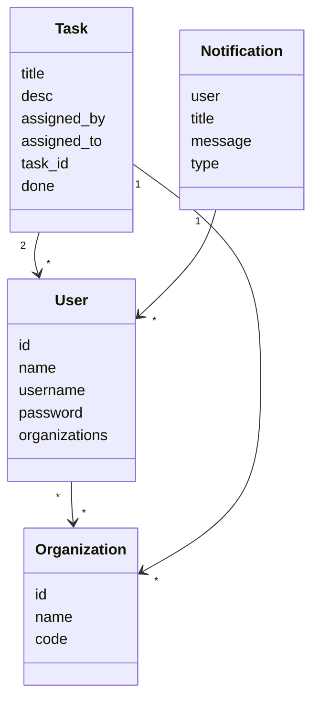
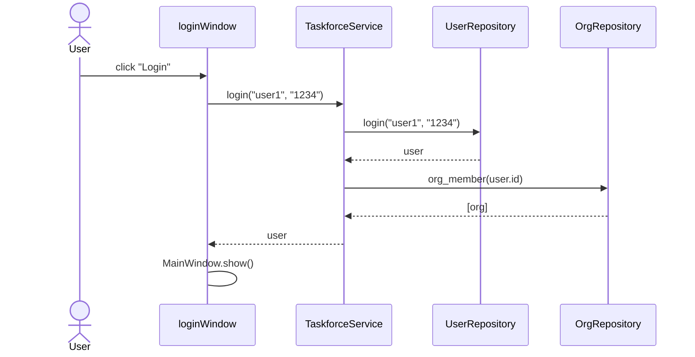
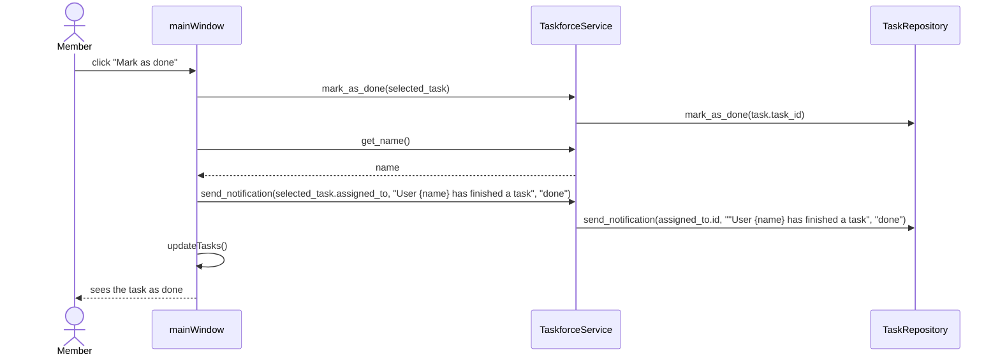

Ohjelmassa käytetään luokkia ´User´ ja ´Organizations´ kuvaamaan käyttäjiä ja organisaatioita, joihin käyttäjät voivat liittyä. Lisäksi on olemassa luokat Task ja Notification, jotka kuvaavat tehtäviä joita käyttäjät voivat saada sekä ilmoituksia, joita käyttäjälle voi tulla.

# Sekvenssikaavio
Alla kuvataan kaksi ohjelman toiminnan kannalta tärkeää prosessia sekvenssikaavioina: sisäänkirjautuminen (olettaen että käyttäjä on olemassa) sekä tehtävän merkiseminen valmiiksi.

## Sisäänkirjautuminen

## Tehtävän merkitseminen valmiiksi

