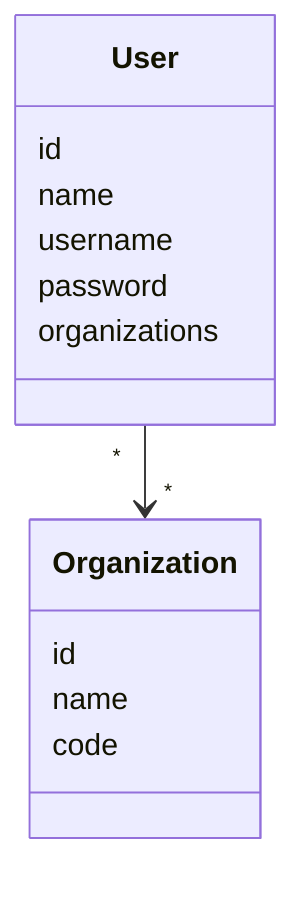

Ohjelmassa käytetään luokkia ´User´ ja ´Organizations´ kuvaamaan käyttäjiä ja organisaatioita, joihin käyttäjät voivat liittyä.

```mermaid
 classDiagram
      User "*" --> "*" Organization
      class User{
          id
          name
          username
          password
          organizations
      }
      class Organization{
          id
          name
          code
      }
```
