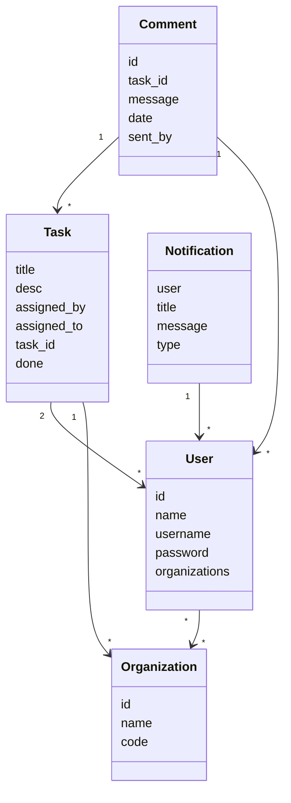
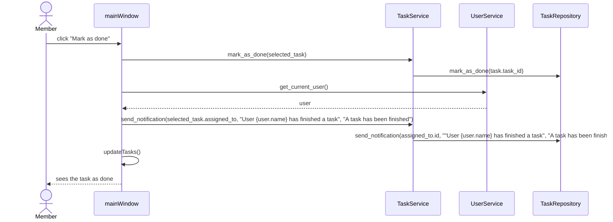

# Arkkitehtuurikuvaus

## Käyttöliittymä

Ohjelmassa on kaksi pääikkunaa:
- Kirjautumisikkuna
- Tehtäväikkuna

Näistä näkyy vain yksi kerrallaan. Lisäksi on seuraavia ikkunoita, jotka voivat näkyä pääikkunoiden päällä:

- Tilinluonti
- Organisaation liittyminen
- Uuden organisaation luonti
- Uuden tehtävän luonti

Nämä ikkunat voivat ilmestyä eri vaiheissa käyttöä.

Käyttöjärjestelmän toiminta on pyritty eristämään mahdollisimman hyvin sovelluksen logiikasta vastaavasta koodista. Kaikki sovelluslogiikan toiminnat kutsutaan erilaisilla Serivce-luokkien metodeilla, jotka taas vastaavat sovelluslogiikasta.

Käyttöjärjestelmä muodostetaan pääosin kun käyttäjä kirjautuu sisään, tosin joitakin asioita voidaan päivittää kun Service-luokkien metodeja kutsutaan. Esimerkiksi jos käyttäjä merkitsee tehtävän valmiiksi, niin kutsutaan käyttöliittymän updateTasks(), joka rakentaa uudelleen tehtävälistan kutsumalla TaskService-luokan metodia get_tasks().

Kuvitellaan tilanne, jossa organisaation ylläpitäjä kirjautuu tililleen, jolla hän on jakanut tehtäviä sekä kommentoinut kyseisiä tehtäviä. Tällöin kirjautuessa käyttöliittymä piirtää kaikille annetuille tehtäville napit, piirtää näytölle tiedot sillä hetkellä valitusta tehtävästä, piirtää kommentit senhetkiselle tehtävälle. Lisäksi käyttöliittymä lisää yläpalkin valikkoihin napit organisaation valintaa varten sekä käyttäjien ylentämistä varten.

## Sovelluslogiikka

Ohjelmassa käytetään luokkia ´User´ ja ´Organizations´ kuvaamaan käyttäjiä ja organisaatioita, joihin käyttäjät voivat liittyä. Lisäksi on olemassa luokat Task, Notification ja Comment, jotka kuvaavat tehtäviä joita käyttäjät voivat saada, ilmoituksia, joita käyttäjälle voi tulla, sekä kommentteja, joita käyttäjät voivat jättää tehtäviin.

Tominallisuuteen liittyvä koodi on jaettu kolmeen luokkaan: UserService, OrgService sekä TaskService.

UserService vastaa käyttäjätietoihin liittyvästä toiminnallisuudesta. Luokka tarjoaa esimerkiksi seuraavat metodit:
- `login(username, password)`
- `signup(name, username, password)`
- `get_current_user()`

UserService käyttää luokkaa UserRepository, joka vastaa käyttäjätietojen pysyväistallennuksesta sekä tietojen noutamisesta tietokannasta. Muut luokat toimiivat vastaavalla tavalla pysyväistallennuksen kanssa.

OrgService vastaa organisaatioihin liittyvästä toiminnallisuudesta. Luokka tarjoaa esimerkiksi seuraavat metodit:
- `join_org(code)`
- `make_admin_in_current_org(user)`
- `get_all_members_in_current_org()`

TaskService vastaa tehtäviin, työpöytäilmoituksiin sekä kommenteihin liittyvästä toiminnallisuudesta. Luokka tarjoaa esimerkiksi seuraavat metodit:
- `get_tasks(filters)`
- `assign_task(assigned_to, title, desc)`
- `send_notification(user, message, title)`
- `post_comment(task, message)`

## Tietojen pysyväistalletus

Tietojen pysyväistalennusta varten käytetään PostgreSQL-tietokantaa. Ensisijaisesti tarkoituksena olisi käyttää verkossa olevaa tietokantaa, mutta myös paikallista tietokantaa voi käyttää. Tietokannan osoite kirjoitetaan .env-tiedostoon parametrilla `DATABASE_URL`.
Tietokannan rakenteen voi nähdä tiedostosta [create_db_schema.py](https://github.com/sonicsasha/taskforce/blob/master/src/create_db_schema.py), jota käytetään tietokannan alustamiseen.

## Sekvenssikaavio
Alla kuvataan kaksi ohjelman toiminnan kannalta tärkeää prosessia sekvenssikaavioina: sisäänkirjautuminen (olettaen että käyttäjä on olemassa) sekä tehtävän merkiseminen valmiiksi.

### Sisäänkirjautuminen

Kun käyttäjä painaa painiketta _Login_, niin käyttöliittymä kutsuu sovelluslogiikan luokan _UserService_ metodia `login(username, password)`. Parametrit saadaan käyttöliittymän tekstikentistä. Tällöin _UserService_ kutsuu luokan _UserRepository_ metodia `login(username, password)`, joka sitten yrittää etsiä tietokannasta käyttäjää, jonka käyttäjänimi ja salasana vastaavat syötettä. Jos käyttäjää ei löydy, niin _UserRepository_ heittää virheen, jonka _UserService_ välittää käyttöliittymälle, ja käyttöliittymä näyttää virheilmoituksen. Jos käyttäjä kuitenkin löytyy, niin _UserRepository_ välittää käyttäjän tiedot _UserService_:lle, joka tallentaa käyttäjän tiedot muuttujaan, minkä jälkeen käyttöliittymä vaihtaa näkymän pääikkunaan.

### Tehtävän merkitseminen valmiiksi

Kun käyttäjä painaa painiketta _Mark as done_, niin käyttöliittymä kutsuu luokan _TaskService_ metodia `mark_as_done(task)`, missä muuttuja `task` kuvaa sillä hetkellä valittua tehtävää. Tämän jälkeen _TaskService_ kutsuu luokan _TaskRepository_ metodia `mark_as_done(task_id)`, joka merkitsee muutoksen tietokantaan. Seuraavaksi käyttöliittymä kutsuu metodia `send_notification(user, message, title)`, joka taas kutsuu luokan _TaskRepository_ metodia `send_notification(user_id, title, message)`, joka tallentaa työpöytäilmoituksen tiedot tietokantaan. Lopuksi käyttöliittymä kutsuu omaa metodia `UpdateTasks()`, joka päivittää tehtävälistan, jotta tehtävä näkyisi valmiina.

### Ohjelman rakenteen heikkoudet / parannusideat

Tehokkaampi tietokannan ja välimuistin käyttö. Koska käytetään verkossa olevaa tietokantaa, niin tietojen hakeminen voi olla hidasta, minkä takia ainakin osa tiedoista voisi pitää muistissa. Näin on tehty kommenttien osalta, mutta myös muidenkin asioiden osalta voisi toimia näin. Esimerkiksi nyt kun tehtävä merkitään valmiiksi, niin sovellus hakee kaikki käyttäjän tehtävät tietokannasta, vaikka tämän voisi tehdä tehokkaammin ja paikallisesti.
