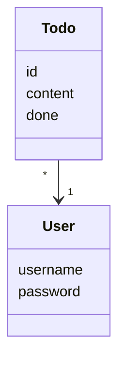

'''mermaid
classDiagram
	Pelaaja "2-8" --> "1" Pelilauta
	class Noppa
	class Pelaaja
	class Pelilauta
	class Ruutu
	class Nappula
'''

## Sovelluslogiikka

Sovelluksen loogisen tietomallin muodostavat luokat User ja Todo, jotka kuvaavat käyttäjiä ja käyttäjien tehtäviä:

